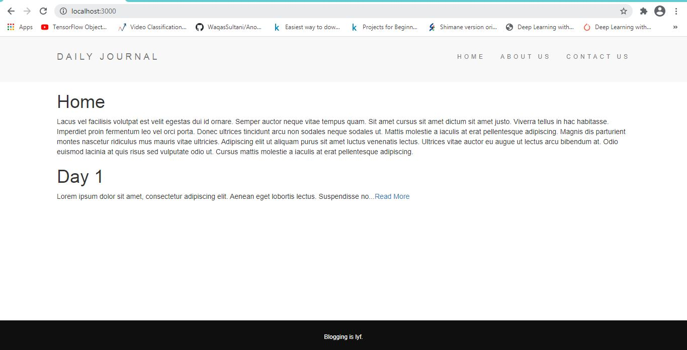
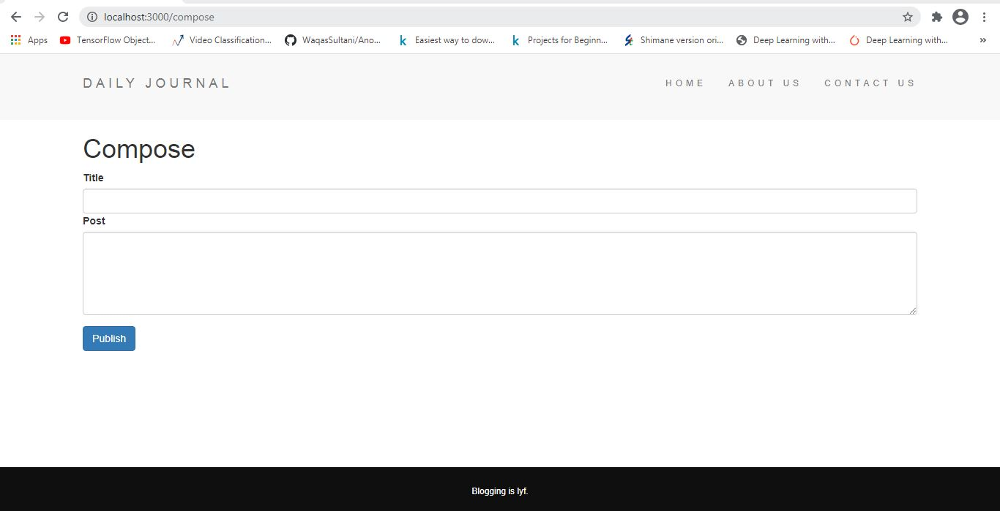
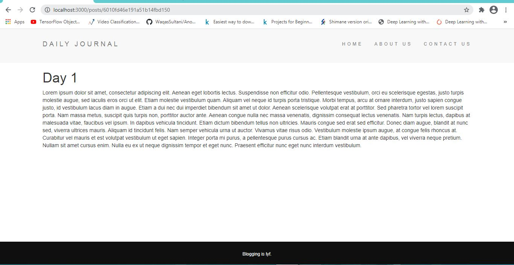

# Blog web app
This is a simple Blog Web application created using [Node.JS](https://nodejs.org/en/), [Express](https://expressjs.com/), [EJS](https://ejs.co/) and [MongoDB](https://www.mongodb.com/2). The project looks like:

## How to start it

Download all dependencies using 

#### `npm i`

Then to host it locally

#### `node app.js`

The web app will be at [http://localhost:3000/]( http://localhost:3000/)
